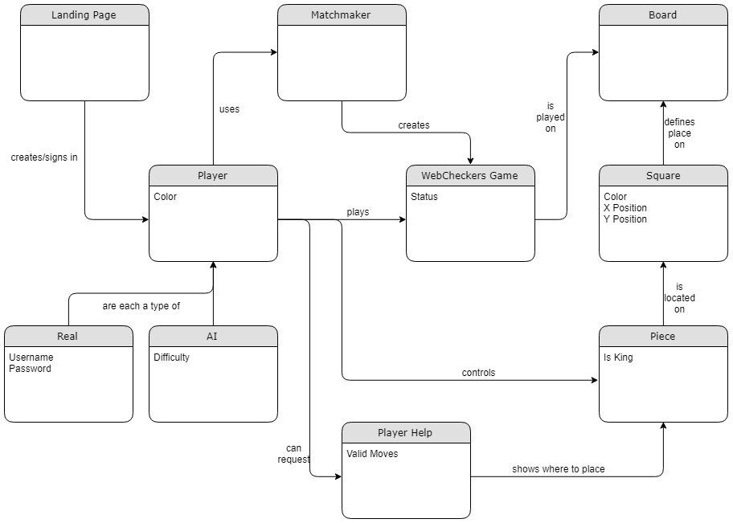
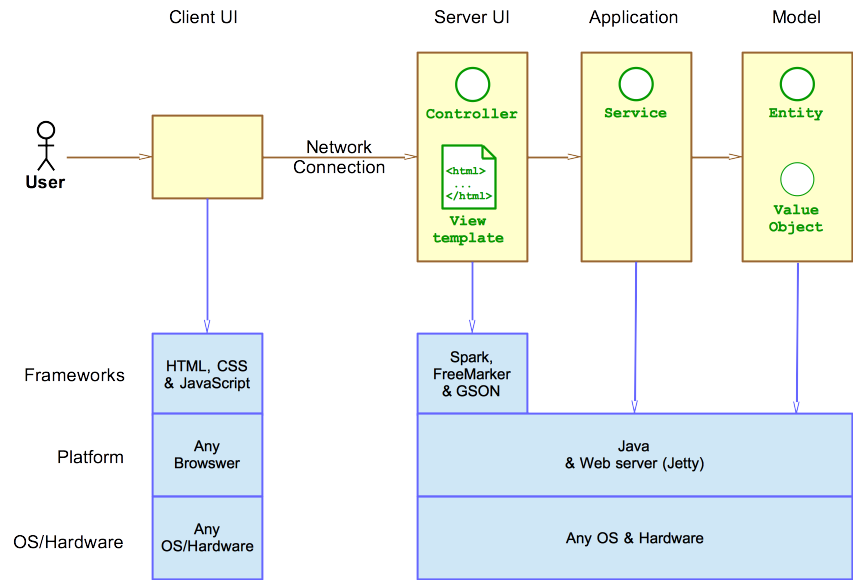
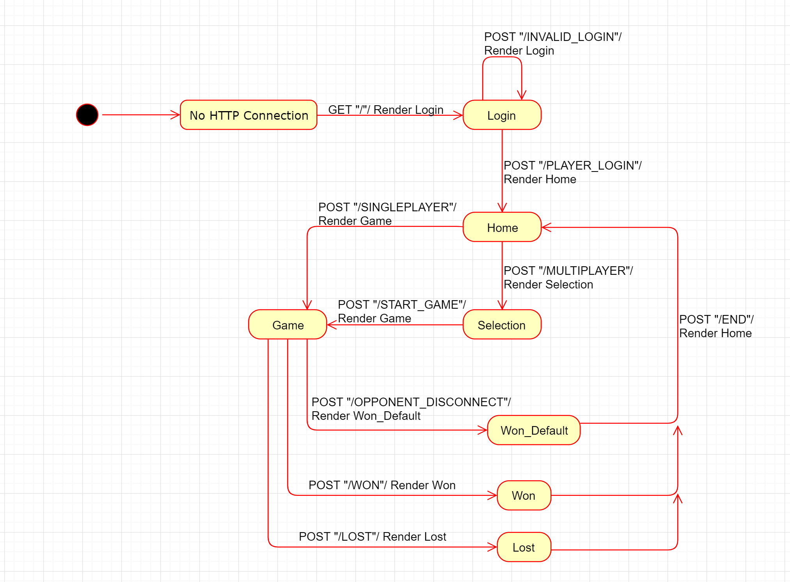

# PROJECT Design Documentation

## Team Information

* Team name: Applications Anonymous
* Team members
  * Matt Agger
  * Johnny Ricatone
  * Sarah Strickman
  * Matthew Rho

## Executive Summary

This is a summary of the project.

### Purpose

The purpose of this project is to create the WebCheckers application for
the user group of players. These players should be able to play checkers
with other players who are currently signed-in, and the game UI will support
the game experience of players using drag-and-drop browser capabilities
for making moves. In addition to the basic checkers game, players will
be able to optionally utilize a hint system and play against an AI player
to further enhance their experience.

### Glossary and Acronyms

| Term | Definition |
|------|---------------------------|
| UI | User Interface |
| AI | Artificial Intelligence |
| MVP | Minimal Viable Product |
| HTML | HyperText Markup Language |
| CSS | Cascading Style Sheets |
| POJO | Plain-Old Java Object |

## Requirements

This section describes the features of the application.

> _In this section you do not need to be exhaustive and list every
> story.  Focus on top-level features from the Vision document and
> maybe Epics and critical Stories._

### Definition of MVP

> _Provide a simple description of the Minimum Viable Product._

### MVP Features

> _Provide a list of top-level Epics and/or Stories of the MVP._

### Roadmap of Enhancements

> _Provide a list of top-level features in the order you plan to consider them._

## Application Domain

This section describes the application domain.

The landing page creates and signs in a real player, who has a color and
a username. Real players can play a WebCheckers game after matching up
with either another real player or an AI player, who has a color and a
difficulty. WebCheckers games are played on a board, and players can control
one of their pieces at a time, which can possibly be a king. Pieces are
located on a square, which has a color and a position, and numerous squares
define spaces on a board. While playing a WebCheckers game, players can
request player help, which has valid moves, and this can show players where
to place a piece.

## Architecture and Design

This section describes the application architecture.

### Summary

The following Tiers/Layers model shows a high-level view of the webapp's architecture.

As a web application, the user interacts with the system using a
browser. The client-side of the UI is composed of HTML pages with
some minimal CSS for styling the page. There is also some JavaScript
that has been provided to the team by the architect.

The server-side tiers include the UI Tier that is composed of UI Controllers and Views.
Controllers are built using the Spark framework and View are built using the FreeMarker framework.
The Application and Model tiers are built using POJOs.

Details of the components within these tiers are supplied below.

### Overview of User Interface

This section describes the web interface flow; this is how the user views and interacts
with the WebCheckers application.

Once users connect, they are brought to the home page. Clicking the sing-in
button takes them to the sign-in page. Entering an invalid username keeps
users on the sign-in page and display an error message. Entering a valid
username takes them back to the home page and shows the other current players.
Clicking the sign-out button keeps users on the home page and hides the
other current players. Clicking a player's name who is in a game keeps
them on the home page and displays an error message. Clicking a player's
name who is not in a game takes them to the game page. Disconnecting or
clicking the resign button takes users back to the home page and shows
the other current players. Winning or losing a game also takes them back
to the home page and shows the other current players.

### UI Tier

> _Provide a summary of the Server-side UI tier of your architecture.
> Describe the types of components in the tier and describe their
> responsibilities.  This should be a narrative description, i.e. it has
> a flow or "story line" that the reader can follow._

> _At appropriate places as part of this narrative provide one or more
> static models (UML class structure or object diagrams) with some
> details such as critical attributes and methods._

> _You must also provide any dynamic models, such as statechart and
> sequence diagrams, as is relevant to a particular aspect of the design
> that you are describing.  For example, in WebCheckers you might create
> a sequence diagram of the `POST /validateMove` HTTP request processing
> or you might show a statechart diagram if the Game component uses a
> state machine to manage the game._

> _If a dynamic model, such as a statechart describes a feature that is
> not mostly in this tier and cuts across multiple tiers, you can
> consider placing the narrative description of that feature in a
> separate section for describing significant features. Place this after
> you describe the design of the three tiers._

### Application Tier

> _Provide a summary of the Application tier of your architecture. This
> section will follow the same instructions that are given for the UI
> Tier above._

### Model Tier

> _Provide a summary of the Application tier of your architecture. This
> section will follow the same instructions that are given for the UI
> Tier above._

### Design Improvements

> _Discuss design improvements that you would make if the project were
> to continue. These improvement should be based on your direct
> analysis of where there are problems in the code base which could be
> addressed with design changes, and describe those suggested design
> improvements. After completion of the Code metrics exercise, you
> will also discuss the resutling metric measurements.  Indicate the
> hot spots the metrics identified in your code base, and your
> suggested design improvements to address those hot spots._

## Testing

> _This section will provide information about the testing performed
> and the results of the testing._

### Acceptance Testing

> _Report on the number of user stories that have passed all their
> acceptance criteria tests, the number that have some acceptance
> criteria tests failing, and the number of user stories that
> have not had any testing yet. Highlight the issues found during
> acceptance testing and if there are any concerns._

### Unit Testing and Code Coverage

> _Discuss your unit testing strategy. Report on the code coverage
> achieved from unit testing of the code base. Discuss the team's
> coverage targets, why you selected those values, and how well your
> code coverage met your targets. If there are any anomalies, discuss
> those._
